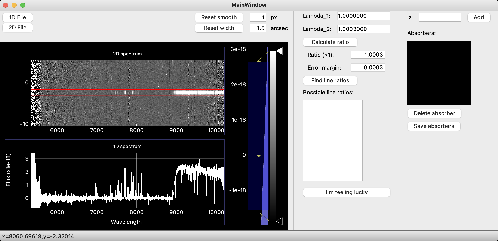

# *z*Hunter

*z*Hunter is a Graphical User Interface (GUI) tool to visualize and perform basic manipulation of 1D and 2D astronomical spectra.
It is originally developped to help find (hunt for) the redshift *z* of transient sources observed spectroscopically, hence its name.
It uses [`Python 3.9`](https://www.python.org/downloads/release/python-3916/) and is based on the [`pyqtgraph`](https://pyqtgraph.readthedocs.io/en/latest/introduction.html) library for speed (as opposed to the more commonly used [`matplotlib`](https://matplotlib.org/)).


# Installation

If you use a virtual environment manager for python (which we recommend), you can create an environment specific for *z*Hunter with:

```
$ conda env create -f zhunter_conda_env.yaml
```

## Using pip

```
$ pip install zhunter
```

If you want the latest development you can switch to the `dev` branch and to
```
$ pip install .
```

*Note:* sometimes the pip installation of PyQt5 fails, in this case try to install PyQt5 with conda:
```
$ conda install pyqt
```

## Launching the GUI
If the installation went smoothly, you can launch the GUI by simply typing in your terminal:
```
$ zhunter
```
You can make sure the code works by loading the 2D file `./example_data/example_2D.fits` (*hint*: GRB redshift is around 6.3).

# Usage

For a summary of the various key bindings discussed below, press `h` (for help).

## Loading a file

To load a file, simply use the `1D File` or `2D File` buttons corresponding to your case. The files should be in a standard `FITS` format.

## Hunting for a redshift

Once you've loaded a file, the hunt begins. You can move around the spectrum by left-clicking and dragging, by right-clicking and zooming or with the keys `a`, `s`, `d` and `w`.

### From 2D to 1D: extracting the trace

The first thing you want to look for is the trace in the 2D; once you have it, place the red rectangle (you can adjust the width) to encase the continuum as shown below.


### Looking for features

Now that you have your 2D with a good corresponding 1D, you can start looking for the easiest features to identify; these include damped Lyman-alpha absorption (DLA) as shown below circled in blue, any emission lines and common absorption lines.


### Using line ratios to find the redshift

If you don't see any obvious DLA, you can scan through the spectrum to find absorption lines. While the wavelength of each absorption line may be redshifted due to the expansion of the Universe, the ratio between the wavelengths of two lines remains constant. Try to look for doublets, or lines close to each other with similar line profiles; this may indicate they originate from the same absorbing gas and therefore are related.
To calculate the ratio between two wavelengths, place your cursor above the first line and press the `e` key, this should fill the `Lambda_1` box, then move your cursor to the second line and press the `q` key for `Lambda_2`.
You can then calculate the ratio by pressing the corresponding button, and by specifying an error margin you can look up the possible line ratios. If you find too many options for the line ratios, try reducing the error margin if you are confident of your lambda placements.


### Adding an absorber

Finally, if you are confident you have identified the correct transitions, you can select them in the list and use the `I'm feeling lucky` button. This will overplot a number of transitions, indicated by vertical lines, at the correct redshift on your 1D spectrum; note that not all of these transitions need to be present in your spectrum, some have low transition probabilites but are included for completeness. The list of lines used for adding absorbers probably will evolve as we work out which ones are most relevant.
This process is illustrated below.


Note: you can also add an absorber manually with the button on the top right.